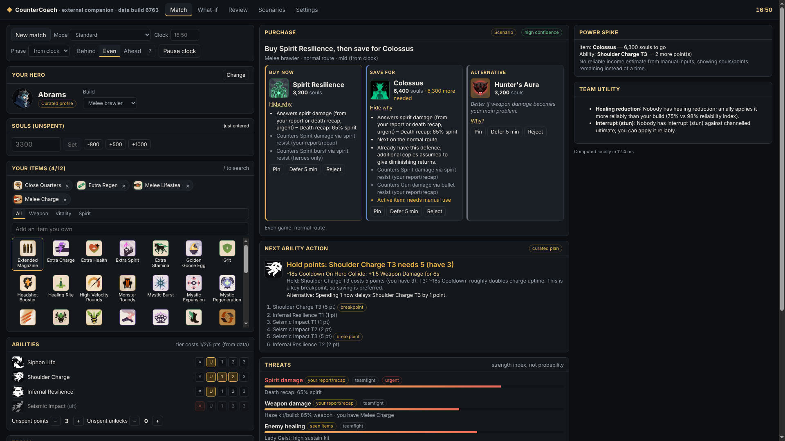

# CounterCoach

An external companion app for Valve's **Deadlock**. It tells you what to **buy now**, what to
**save for**, a **situational alternative**, and the **next ability unlock or upgrade**. The
advice adapts to the enemy heroes, the items you've seen on them, and the problems you report,
while keeping your chosen build's identity.

> **Status (build 0.1.0, 2026-10-08):**
> - Working companion with manual, scenario and replay inputs, real game data (client build
>   6763), and 89 passing tests.
> - The Windows installer and zip are built (unsigned). Install and uninstall were checked
>   **under Wine only**.
> - **Not tested on Windows or with a running Deadlock match.**
> - There is **no native mod and no live game integration**, because no permitted interface
>   exists. See [docs/CAPABILITIES.md](docs/CAPABILITIES.md).



## What it is, and what it isn't

- It **is** a normal desktop app. You enter what you can see (hero, souls, items, enemies, what
  is hurting you). A local, deterministic engine explains its advice: which threat each item
  answers, how that threat is known, what the purchase delays, and how confident the advice
  is.
- It **is not** a game mod or a cheat. No game-file edits, memory reading, injection, packet
  capture, hidden information, or automated purchases or skill points. It is not affiliated
  with or endorsed by Valve, and it makes no claim to be approved or ban-proof.

## Quick start (development)

Requires Node ≥ 22.12 and pnpm 10 (`corepack enable`).

```bash
cd countercoach
pnpm install --frozen-lockfile
pnpm test                      # 89 tests
pnpm typecheck
pnpm build && pnpm --filter @countercoach/desktop start   # run the Electron app
```

Other commands:

| Command | Does |
|---|---|
| `pnpm ingest` | Fetch, validate and quality-gate a new data snapshot (keeps last-known-good) |
| `npx tsx scripts/stamp-review.ts` | Mark the current data as reviewed (after checking profiles and rules) |
| `pnpm docs` | Regenerate `docs/COVERAGE.md` and `docs/COUNTER_RULES.md` from code and data |
| `pnpm dist:win` | Build the Windows NSIS installer and portable zip (on Linux this needs Wine 32+64-bit) |
| `pnpm screenshots` | Drive the real Electron app under Xvfb and capture `docs/screenshots` |
| `pnpm --filter @countercoach/desktop build:web` | Build the same UI as a static browser preview (`dist-web/`) |

Installing, using, disabling, uninstalling and rolling back: [docs/USAGE.md](docs/USAGE.md).

## Documentation

| Doc | Contents |
|---|---|
| [CAPABILITIES.md](docs/CAPABILITIES.md) | Integration investigation (evidence, build, date), route decision, final capabilities report |
| [USAGE.md](docs/USAGE.md) | Install / use / overlay / disable / uninstall / backups / rollback |
| [ARCHITECTURE.md](docs/ARCHITECTURE.md) | Modules, data flow, security model |
| [SCORING.md](docs/SCORING.md) | Candidate generation, legality, scoring weights, selection, stability, confidence |
| [STATE.md](docs/STATE.md) | Observation model, freshness, conflicts, corrections, match lifecycle, replay |
| [DATA.md](docs/DATA.md) | Data sources, snapshot schema, validation, quality gate, patch invalidation, assets licensing |
| [COUNTER_RULES.md](docs/COUNTER_RULES.md) | All counter rules and the current items providing each response (generated) |
| [COVERAGE.md](docs/COVERAGE.md) | Hero profile coverage: curated vs data-derived (generated) |
| [TEST_RESULTS.md](docs/TEST_RESULTS.md) | Test, performance, packaging and Wine results; screenshot index |

## Layout

```
packages/engine    UI-independent engine (rules, mechanics, counters, profiles, state, recommender, planner, features)
packages/ingest    data ingest CLI/library (validation, quality gate)
apps/desktop       Electron main/preload + React renderer (overlay + separate window)
data/              versioned snapshots, manifest, review stamps
fixtures/          scenario fixtures
docs/              documentation and screenshots
```

Game data comes from the community [Deadlock API](https://api.deadlock-api.com/docs) (not
Valve). Icons are loaded at runtime from its asset CDN and are not bundled.
