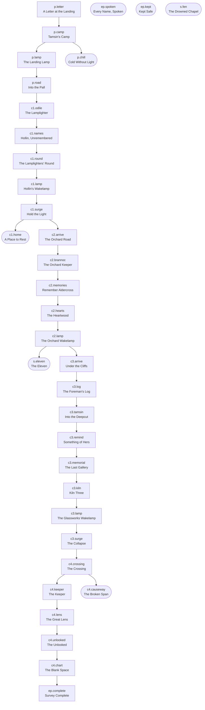

# ⚠️ SPOILERS — Quest graph (generated)

> Developer-only. Generated by `tools/gen_all.py` from the quest registry; do not edit by hand.
> State per quest lives in scoreboard `pm.q` (0 locked, 1 active, 2 done); progress in `pm.qp`.

| Quest | Chapter | Main | Prerequisites | Objective | Target POI | Progress |
|---|---|---|---|---|---|---|
| `p.letter` | Prologue | yes | — | Read the letter pinned to the noticeboard. | `landing.noticeboard` | — |
| `p.camp` | Prologue | yes | `p.letter` | Find Tamsin's camp up the road. | `landing.camp` | — |
| `p.lamp` | Prologue | yes | `p.camp` | Rebuild the broken lamp beside the road. | `landing.lamp` | 4 |
| `p.road` | Prologue | yes | `p.lamp` | Follow the lamp road north to Hollin. | `hollin.gate` | — |
| `p.chill` | Prologue | no | `p.camp` | Walk in the fog holding a torch or lantern. | — | — |
| `c1.odile` | Chapter 1 | yes | `p.road` | Speak with the lamplighter at Hollin's gate. | `hollin.odile` | — |
| `c1.names` | Chapter 1 | yes | `c1.odile` | Find the names of Hollin's four lost places. | `hollin.well` | 4 |
| `c1.round` | Chapter 1 | yes | `c1.names` | Ring Hollin's four bells in the order of the Round. | `hollin.bell.marsh` | — |
| `c1.lamp` | Chapter 1 | yes | `c1.round` | Rebuild the Wakelamp at the top of the bell tower. | `hollin.wakelamp` | 7 |
| `c1.surge` | Chapter 1 | yes | `c1.lamp` | Relight the four plaza lamps while the Pall pushes back. | `hollin.plaza` | 4 |
| `c1.home` | Chapter 1 | no | `c1.surge` | Place a bed in the Surveyor's Rest. | `hollin.home.rest` | — |
| `c2.arrive` | Chapter 2 | yes | `c1.surge` | Travel east to the orchards of Aldercross. | `aldercross.gate` | — |
| `c2.brannoc` | Chapter 2 | yes | `c2.arrive` | Speak with the orchard keeper. | `aldercross.brannoc` | — |
| `c2.memories` | Chapter 2 | yes | `c2.brannoc` | Find the three places Aldercross remembers. | `aldercross.tree` | 3 |
| `c2.hearts` | Chapter 2 | yes | `c2.memories` | Break the three hearts grown into the Heartwood. | `aldercross.heartwood` | 3 |
| `c2.lamp` | Chapter 2 | yes | `c2.hearts` | Rebuild the Wakelamp in the windmill's cap. | `aldercross.wakelamp` | 7 |
| `s.eleven` | Optional | no | `c2.lamp` | Find the keepsakes of the eleven lost miners. | — | 11 |
| `c3.arrive` | Chapter 3 | yes | `c2.lamp` | Follow Tamsin north to the Glassworks. | `glassworks.gate` | — |
| `c3.log` | Chapter 3 | yes | `c3.arrive` | Read the last log in the foreman's office. | `glassworks.log` | — |
| `c3.tamsin` | Chapter 3 | yes | `c3.log` | Find Tamsin inside the Deepcut. | `deepcut.tamsin` | — |
| `c3.remind` | Chapter 3 | yes | `c3.tamsin` | Show Tamsin three things that are hers. | `deepcut.tamsin` | 3 |
| `c3.memorial` | Chapter 3 | yes | `c3.remind` | Go past the blue seam to where the Deepcut fell. | `deepcut.memorial_wall` | — |
| `c3.kiln` | Chapter 3 | yes | `c3.memorial` | Fire Kiln Three the way the foreman's log describes. | `glassworks.firebox` | — |
| `c3.lamp` | Chapter 3 | yes | `c3.kiln` | Rebuild the Wakelamp on top of the kiln tower. | `glassworks.wakelamp` | 7 |
| `c3.surge` | Chapter 3 | yes | `c3.lamp` | Relight the four candles in the kiln yard before the Pall closes in. | `glassworks.yard` | 4 |
| `c4.crossing` | Chapter 4 | yes | `c3.surge` | Cross Vellmere to the Meridian. | `meridian.dock` | — |
| `c4.keeper` | Chapter 4 | yes | `c4.crossing` | Find the Keeper in the Chart Room. | `meridian.hesper` | — |
| `c4.lens` | Chapter 4 | yes | `c4.keeper` | Set the Lens Heart in the Great Lens atop the tower. | `meridian.cradle` | — |
| `c4.unlooked` | Chapter 4 | yes | `c4.lens` | Face what the Pall has become. | `meridian.arena` | — |
| `c4.chart` | Chapter 4 | yes | `c4.unlooked` | Decide what the Long Chart says about the Deepcut. | `meridian.chart_table` | — |
| `ep.complete` | Epilogue | yes | `c4.chart` | Free play: the Vale is yours to explore. | — | — |
| `c4.causeway` | Optional | no | `c4.crossing` | Mend the gap in the Meridian causeway. | `meridian.causeway_gap` | — |
| `ep.spoken` | Optional | no | — | You read all eleven names aloud. | — | — |
| `ep.kept` | Optional | no | — | You gave the keepsakes to the Keeper. | — | — |
| `s.fen` | Optional | no | — | Drain the flooded crypt under the Fen chapel. | `fen.levers` | — |

Auto-activation: every quest with `auto=True` activates when all its prerequisites are done (`palemeridian:q/_advance`). `ep.spoken`, `ep.kept` and `s.fen` are activated by story events instead.
