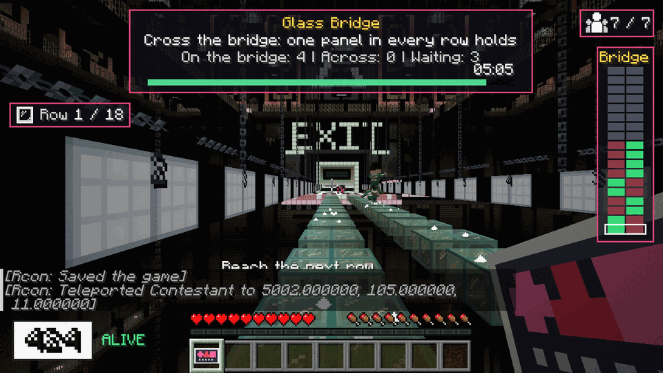

# Game 5 - Glass Bridge

Game id `glass_bridge` (`GameKind.GLASS_BRIDGE`, arena `ArenaId.GLASS_BRIDGE`, causes `EliminationCause.FELL` / `TIMEOUT`).
Implemented in:

| Layer | Package / file |
|-------|----------------|
| pure rules (JUnit tested) | `core/bridge/`: `BridgeRoute`, `BridgeKnowledge`, `BridgeRules`, `BridgeQueue`, `BridgeLayout`, `HopPlanner`, `BridgeNpcRules` |
| server game | `game/bridge/`: `GlassBridgeGame` (the `MiniGame`), `BridgeNpcBehavior` + `BridgeMotor` (NPC brain and body), `BridgePublicView` (what NPCs may see), `PanelField` (panels in the world), `Crosser`, `BridgeMapPayload` + `BridgeNet` (public-knowledge packet) |
| client | `client/game/bridge/`: `BridgeClient` (registers the receiver, found by name), `BridgeOverlay` (row map) |
| fixture arena | `build/placeholder/GlassBridgePlaceholder` (version 0, real geometry) |
| translations | `tools/lang/glass_bridge.json` (merged into `en_us.json` by `tools/merge_lang.py`) |
| tests | `src/test/java/com/squidgame/core/bridge/` (`BridgeSim` is a whole-game simulator on the pure rules) |

Test it: `squid debug play glass_bridge 16 [normal|hard|extreme]` (no player online = NPC-only run; `/tick rate 100` makes
a long game pass 5x faster; `squid config debug true` prints the `[bridge]` log lines quoted below).

## The game

Eighteen rows of two glass panels span a pit. In every row one panel is **tempered** (holds you) and one is **fragile**
(shatters, you fall = eliminated). Nobody knows which is which. The contestants cross **one after another in a random
order drawn at the start**; the first ones gamble, the later ones learn from what they *saw* happen. Everybody who
reaches the far platform survives. Whoever is not across when the time runs out is eliminated. A **small field** (fewer
than 12 contestants) cannot find the way across by trial and error, so the guards show it the first rows of the bridge
up front (see "Small fields" below); the Planner sends the bridge to every field of four or more.

## Arena contract as used

Geometry (`docs/ARENA_MARKERS.md`): panels are 2x2 blocks of `squidgame:bridge_glass` at deck height y = 40 (standing
height 41 above the arena origin), lane 0 at x -3..-2, lane 1 at x 1..2, row r at z 10 + 3r .. 11 + 3r (1 block between
rows, 2 blocks between lanes), start platform in front of row 0, end platform behind row 17, open pit down to y = -30.

Markers read by the game: 36 `bridge.panel` (`row=R,lane=L`), `bridge.queue` (`slot=N`, slot 0 at the gate), `bridge.gate`
(door marker, `w=7,h=5`), `bridge.finish_spawn`, `bridge.pit_floor`, optional `bridge.hanging_cage`; regions
`bridge.start`, `bridge.finish` (the platforms; they define where take-offs and finish checks happen). The panel marker is
interpreted as *a point on the first (lowest x, lowest z) block of the panel*: the footprint is the 2x2 blocks starting at
the block that contains it. That is the documented convention (x -2.5 / 1.5, z 10.5 + 3r) and a marker given at the
panel's centre (x -2 / 2, z 11 + 3r) gives the same footprint, so both builders' conventions work. If the markers are
missing or incomplete the game logs an error and ends immediately with everybody surviving.

Left / right: the HUD and the overlay name lanes **as the contestant sees them walking +Z**: lane 1 (x = +1.5) is the
*left* lane, lane 0 the *right* one (the arena document's "left/west" is the map view).

## Rules as implemented

1. **Route.** `BridgeRoute` holds one safe lane per row, generated from the tournament seed and game number in
   `prepare` (or restored from the saved game state, see below). It lives only in `GlassBridgeGame`; the NPC
   behaviours receive a `BridgePublicView` that has no reference to it, and `BridgeRoute.toString` prints `hidden`. The
   route never changes while the game runs (it is not re-drawn when somebody falls).
2. **Order and gate.** `placeContestants` draws a random crossing order (`BridgeQueue`) and stands the contestants on the
   `bridge.queue` slots, the first in line next to the gate. The gate door (`bridge_gate`) stays closed through the
   countdown. 3.5 s after the start the gate calls the first contestant (title YOUR TURN + chime for a human, the door
   slides open, the guard gestures). The next one is called when
   * nobody is still standing at the gate,
   * fewer than `maxCrossers` contestants are on the bridge,
   * `minReleaseSpacing` has passed since the last call, and
   * the previously called contestant is at least `releaseGapRows` rows into the bridge (or finished / gone).

   Nobody can skip the line: a queued human who walks through the open door out of turn is put back on their slot,
   and a finished contestant who walks back onto the glass is put back on the far platform. The next in line walks up to
   the gate while the previous one crosses (on-deck staging), so the gate does not wait for a walk across the platform.
   A called contestant who has not touched the first panel within `callLimit` is eliminated (`TIMEOUT`, "froze at the
   gate").
3. **One contestant per panel.** A panel is occupied from take-off to landing and can be reserved by an NPC about to
   hop onto it; nobody lands on an occupied or reserved panel. Two humans may be on the bridge at the same time (different
   rows or lanes).
   **Every row has to be stepped on.** A sprint jump that lands two rows ahead (or on the far platform from the last
   but one row) would dodge a row's gamble: such a landing is not accepted, nothing is judged and the contestant is put back
   on the last panel they stood on (or the platform) with a message ("You have to step on every row").
4. **Judging a panel (humans and NPCs alike, `GlassBridgeGame.arrive`).** A contestant "is on a panel" when their body is
   `onGround` on the glass surface and the 0.6 wide hit box overlaps the panel's 2x2 footprint. The first touch decides:
   * *tempered*: nothing happens; after `confirmTicks` (just longer than the shatter window) the row is publicly
     recorded as **held** (soft chime and a shimmer on the glass) and everybody who watched knows which lane is safe;
   * *fragile*: the panel **cracks at once** (glass-crack sound, shards, the vanilla crack overlay grows over the four
     blocks) and **shatters 6-10 ticks later** (`shatterDelayMin..Max` by difficulty; shards, cloud, loud shatter).
     The contestant is **condemned the moment they touch it, however fast they run on**: a human is frozen with fear
     (Slowness 10 so they cannot walk, the jump strength attribute zeroed so they cannot hop away - a negative Jump
     Boost is not an option, vanilla clamps the amplifier to 0..255 - plus a white flash and a danger pulse) and falls
     with the glass; an NPC is told its panel cracked and cowers. The row is publicly recorded as **broken** when the
     glass goes. Whoever else touches a cracking panel goes down with it.
   * A body that is more than 6 blocks below the deck has fallen: `EliminationCause.FELL`, "No. 087 fell at row 5", the
     spotlight rigs above the deck flash and the impact is heard from the pit floor 1.3 s later. Nobody is teleported:
     the body falls down the pit and the tournament removes it later. Safety net: a condemned contestant who is
     somehow still above the pit 26 ticks after the glass went is eliminated anyway, so nobody survives by clinging to
     an edge.
5. **Public knowledge.** Every *held* / *broken* / *shown* event goes into the `BridgeKnowledge` log; a row is known
   when one panel has been seen holding or shattering, or the guards showed it (the other lane is then the opposite). The
   log feeds the NPCs (through the public view), the HUD ("Row 7, left panel: shattered") and the client overlay. Nothing
   else about the route is ever published.
6. **Stall rule.** The stall clock of a contestant starts at the moment they land on a new row and runs while they stay
   on that row. It is **held while somebody stands on a panel of the next row** (waiting behind a slower contestant never
   counts). When it expires the glass under them cracks (8 ticks) and the contestant falls (`FELL`; "too long on one
   panel"). That panel was tempered, so the bridge must stay passable: it **re-forms 5 s after it
   shattered** (as soon as nothing is inside it). Humans see the stall bar and, in the last `stallWarn` seconds, a red
   pulsing screen edge with the heartbeat and a MOVE! banner.
7. **Timeout.** `timeLimit = max(base, fixed + perContestant * contestants)` (see the table), scaled by the global
   `timeScale`. When it runs out ("TIME'S UP") everybody not across is eliminated (`TIMEOUT`); the panel under anybody who
   is still on the bridge shatters. So the clock only matters for a big crowd: the gate needs about 7 / 8.5 / 11 s per
   contestant (Normal / Hard / Extreme: fewer simultaneous crossers and longer call spacing as it gets harder), and the
   allowance per contestant is 11.4 / 4.5 / 2.9 s, which is the difficulty ladder for crowds (below). A contestant who
   went back to the start platform after having entered the bridge and stands there for 6 s is eliminated the same way
   (so nobody can block the gate by standing off the glass).
8. **Finishing.** A contestant on the far platform (on the ground, inside `bridge.finish`) is safe: title "YOU MADE IT
   - across the bridge as number N", the finish rank is stored in the contestant's stats and the contestant is taken to
   its `bridge.finish_spawn` slot (NPCs walk there, celebrate or cry). The game ends as soon as everybody still alive is
   across. If everyone falls early it simply ends: nobody survives, no exception, the tournament carries on.
9. **Cleanup.** Every panel is restored, all crack overlays removed, the guards cleaned up, the client overlay cleared, the
   jump lock and the slowness removed. The bridge is also restored in `prepare`, so a game that starts after a crash or
   a restart always starts with an intact bridge.

### Difficulty table (`BridgeRules.params`)

| | Normal | Hard | Extreme |
|---|---|---|---|
| time limit, shortest (small crowds, the 16 of the show; it applies up to 20 / 33 / 34 contestants) | 330 s | 270 s | 210 s |
| time limit of a big crowd: fixed part + per contestant | 98 s + 11.4 s | 120 s + 4.5 s | 110 s + 2.9 s |
| (what a well-playing NPC field needs: fixed + per contestant, measured) | 62 s + 7.1 s | 34 s + 8.5 s | 11 s |
| stall limit (stay on one row) | 25 s | 18 s | 12 s |
| stall warning (HUD turns red) | last 8 s | last 6 s | last 5 s |
| shatter delay after the first touch | 8-10 ticks | 7-9 ticks | 6-8 ticks |
| "held" is announced after | 16 ticks | 15 ticks | 14 ticks |
| rows the previous contestant must be in before the next is called | 2 | 3 | 3 |
| contestants on the bridge at once | 5 | 4 | 3 |
| minimum time between calls | 2.0 s | 2.5 s | 3.0 s |
| time to step onto the first panel after being called | 33 s | 26 s | 20 s |
| NPC hesitation scale (smaller = more decisive) | 1.0 | 0.85 | 0.70 |
| NPC nerve: slip scale (chance to misstep on a row they know) | x1 | x3 | x7 |
| NPC skill (global `Difficulty.npcSkillBonus`, attention and slips) | +0 | +0.12 | +0.25 |

**The ladder** (whole-game simulation of an NPC-only crowd with the exact rules, 80 games per cell, share of the crowd that
gets across; `BridgeSimTest` asserts it): the survivors of the bridge are decided by the gamble of the first contestants
(about 10 fall whatever the difficulty: every row has a fragile panel somebody must find) and, for a big crowd, by the
clock.

| crowd | Normal | Hard | Extreme |
|---|---|---|---|
| 16 | 36 % | 33 % | 30 % |
| 24 | 57 % | 51 % | 28 % |
| 40 | 70 % | 45 % | 20 % |
| 64 | 79 % | 46 % | 21 % |
| 100 | 85 % | 48 % | 22 % |

So on Normal most of the crowd gets across (the clock never cuts anybody off), on Hard about half, on Extreme few. A crowd
of 16 is decided almost entirely by the gamble (the show's 16 also lost most of its players): the three difficulties then
differ by the shorter stall limit, the faster shatter, the slower and more careful gate and the nerve of the NPCs rather
than by the clock.

### Small fields: the guards show the first rows

The bare bridge needs about ten fallers to reveal itself (every row has a fragile panel somebody must find), so a field of
fewer than about twelve would mostly end with nobody across. A field of **11 or fewer** is therefore shown the first
`18 - U` rows before the first call, where the number of rows still to find `U` comes from a pure, tested table of the field
size and the difficulty (`BridgeRules.unknownRows` / `revealedRows`); a field of 12 or more plays the bare bridge (nothing
changes). The table was calibrated with the whole-game simulation so that on every difficulty somebody gets across in
about 75-90 % of the games and roughly a fifth to two fifths of the field cross (Extreme a little lower):

| contestants | rows still unknown, Normal / Hard / Extreme |
|---|---|
| 3 | 3 / 3 / 2 |
| 4 | 4 / 4 / 3 |
| 5 | 5 / 5 / 4 |
| 6 | 7 / 7 / 5 |
| 7 | 8 / 8 / 7 |
| 8 | 9 / 9 / 9 |
| 9 | 11 / 11 / 10 |
| 10 | 13 / 13 / 12 |
| 11 | 16 / 15 / 15 |
| 12 or more | 18 (the whole bridge) |

(The harder difficulties lose a little chance to the faster shatter, the shorter stall limit and the edgier NPCs, so for
the same chance of getting somebody across they are shown a row or two more.) How it is done:

* **Public channel only.** At the start of the game the game publishes one `SHOWN` event per shown row (the safe lane of that
  row, taken from the retained route) into the same `BridgeKnowledge` log that held / shattered panels go to. NPCs read it
  like everything else (a shown row is never missed, unlike a panel that merely held), the client overlay draws the shown
  rows as known (green safe lane, dim red fragile lane), nothing else changes. The rows behind the shown ones are never
  published: the hidden route still only lives in `GlassBridgeGame`.
* **In the world.** The tempered panels of the shown rows chime and shimmer one after the other along the bridge when the
  game starts (a sweep from the near end), and keep a faint shimmer every 1.5 s, so a human can also see where to step. An
  action bar line says how many rows are shown and how many are left; the instructions get one more line (below).
* **Instructions line** (`squidgame.game.glass_bridge.instruction.7`, only when rows are shown): "Only 6 of you are left,
  too few to find the way across by trial and error: the guards have already tested the first 11 rows for you. The glass that
  holds there is marked on your map and shimmers; the last 7 rows are yours to find."
* **Retained and persisted.** The shown rows are the first rows of the retained route, so the route is the same with or
  without the reveal. `saveState` stores the number of shown rows next to the route and the crossing order; a game resumed
  after a server restart shows exactly the same rows (it does not recompute them from the then smaller field) and
  publishes them again at its start.
* **Falling on a shown row** is only possible by a slip of nerve (the NPC slip chance, x1 / x3 / x7 by difficulty) or for a
  human by stepping on the wrong lane; the stall rule, the timeout and everything else are unchanged.

Whole-game simulation of an NPC-only field as played (400 games per cell): rows shown, contestants across (share of the
field) and the chance that somebody gets across.

| contestants | Normal | Hard | Extreme |
|---|---|---|---|
| 3 | 15 rows, 1.4 (46 %), 81 % | 15 rows, 1.2 (40 %), 73 % | 16 rows, 1.3 (45 %), 81 % |
| 4 | 14 rows, 1.8 (45 %), 89 % | 14 rows, 1.5 (38 %), 81 % | 15 rows, 1.7 (41 %), 84 % |
| 6 | 11 rows, 2.0 (34 %), 85 % | 11 rows, 1.7 (28 %), 76 % | 13 rows, 2.0 (34 %), 88 % |
| 8 | 9 rows, 3.0 (37 %), 96 % | 9 rows, 2.3 (29 %), 85 % | 9 rows, 1.9 (23 %), 75 % |
| 11 | 2 rows, 2.3 (21 %), 82 % | 3 rows, 2.5 (22 %), 82 % | 3 rows, 1.8 (16 %), 72 % |
| 12 (bare bridge) | 0 rows, 2.5 (21 %), 85 % | 0 rows, 2.0 (17 %), 77 % | 0 rows, 1.8 (15 %), 69 % |
| 16 (bare bridge) | 0 rows, 5.9 (37 %) | 0 rows, 5.3 (33 %) | 0 rows, 4.7 (30 %) |

## Controls and UI for humans

No special controls: walk, sprint and jump. Crossing a row means jumping the 1 block gap; changing lane means a sprint
jump over the 2 block lane gap (a diagonal hop is 3.9 blocks and needs a run up from the edge of the panel). Server HUD
widgets (`hudWidgets`):

* waiting: "Ahead" counter (players in front of you); "You are next! Stand by the gate" when on deck;
* called: YOUR TURN banner and the "step onto the bridge" countdown (`callLimit`);
* on the bridge: row counter `7/18`, the stall bar ("Reach the next row", blue "Waiting for the contestant ahead" while
  the clock is held), a MOVE! banner and red edge pulses when it runs low;
* everybody: last event line ("Row 7, left panel: shattered", shown for 11 s) and a status line (on the bridge / across /
  waiting); chat/action-bar lines for calls, falls, finishes and stalls.

Client overlay (`BridgeOverlay`, top right, only while this game is in its GAME phase): one cell per panel, near end at
the bottom, lanes as seen walking forward: grey = nobody knows, green = seen holding (or shown by the guards at the start of
a small-field game), dim red = known weak, black with a red frame = shattered; your row is framed. It is built from the server's public-knowledge packet only (states of
`BridgeKnowledge.snapshot()`), so it can never show more than a spectator saw. The packet is sent to everyone in the
audience whenever the knowledge changes (and every 5 s as a keep-alive) and cleared in `cleanup`.

## NPC behaviour

Per NPC `BridgeNpcBehavior` (brain, throttled with the other NPC thinking) and `BridgeMotor` (body, stepped every
server tick). The NPC sees only `BridgePublicView`: the layout, who stands where, which glass is gone, the queue and the
gate, the public event log and its own stall clock. **What it knows it learned**: new public events are copied into the
NPC's own `NpcMemory` (`bridge.safe.<row>` = safe lane) with a small chance of missing one (attention 98.5-100 % by skill;
the rows the guards showed at the start of a small-field game are never missed), and the decision uses only that memory. A glaring hole in the glass is also "seen": an NPC that wants a panel that has
shattered concludes the other one holds, even if it missed the crash.

* **Queue**: stands on its slot, glances at the bridge, nervous ones shake their heads; the next in line steps up to the
  gate; when called it reacts (personality's reaction time), walks to the platform edge in line with the lane it chose.
* **Known row**: takes the safe lane. A *slip* (stepping on the wrong panel although it knows) happens with
  `slipChance`: 0.1 % to 1.3 % for a sharp / sloppy contestant, scaled by the stall pressure (fraction of the stall limit
  used) and by fear (witnessed falls), capped at 20 %.
* **Unknown row**: hesitates 1-7.5 s depending on caution (longer when frightened, shorter for skilled contestants and on
  harder difficulties, never more than 60 % of the stall limit), then guesses with a personal left / right bias and a
  superstition about repeating or alternating the previous lane (the route is uniform, so no strategy beats a coin flip;
  personality changes how it *looks*). Very low courage may freeze on an unrevealed row until the stall rule breaks the
  glass under it. While somebody stands on a row that is not yet revealed, followers wait for the verdict instead of
  gambling on the other lane.
* **Hopping**: the motor walks to the take-off spot (clamped inside the panel it stands on so it can never step off the
  edge), jumps with a planned up speed (12-13 ticks of flight) and re-aims its horizontal speed every tick at the landing
  point from the remaining flight time, so the touch down is exact and a bump is corrected; gravity and collisions are
  vanilla. Straight hops cover 2.2 blocks, the diagonal lane change 3.9. The `[bridge] hop ...` /
  `landed ... error ... blocks` debug lines show plan and result.
* **Fear**: witnessing a fall raises fear (sooner and more for the timid); it decays slowly and slows the NPC down /
  makes it slip more.
* **After landing**: settles for 0.3-1 s, then decides the next row. When the glass cracks under it the NPC cowers; when it
  is across it celebrates (fist, cheer) or sobs by personality.
* A stand-in that takes over from a disconnected human continues from wherever that human was (queue, gate or panel).

## Persistence and restart

`saveState` stores the route (as bits), the crossing order and the number of rows shown up front; `loadState` (called by the
tournament before `prepare`) puts them back. After a server restart the tournament replays the interrupted game from its instructions with the same
game number and seed. The bridge is rebuilt intact in `prepare` (a half-broken bridge from before the restart does not
survive), the **hidden route is the saved one, and the crossing order is the saved one restricted to the contestants who
are still alive**: those eliminated before the restart stay eliminated, everybody else keeps their relative place in the
queue (a roster that no longer fits the saved order gets a fresh random order). The **rows shown up front are the saved
number, not recomputed from the then smaller field**, and they are published again when the game starts, so a resumed game
begins with the same public knowledge. What is **not** persisted is the rest of the public knowledge: after a restart
nothing has been seen holding or shattering yet (the NPCs and the overlay show only the shown rows) and the contestants who
are still alive have to cross the same bridge again. Humans are treated as absent after a
restart and are taken over by stand-ins until they return (tournament behaviour).

## Edge cases (all handled, see the verification below)

everybody falls early (the game still ends cleanly); a human disconnects on the bridge (stand-in continues); a human or
NPC stalls (the panel breaks, the queue moves on, the panel re-forms); two contestants hop at the same time; a
contestant is eliminated by an admin (`squid debug eliminate`) or knocked off the deck (any body below the deck minus
6 blocks has fallen); a resumed game after a restart (same route, bridge rebuilt, queue restored); 2..128 contestants.

## Verification

All of it on the real arena (`GlassBridgeBuilder`), a dedicated test server and the final rules.

* **Unit tests** (`core/bridge`, plus a codec test of `BridgeMapPayload`): route generation and retention, public knowledge,
  difficulty table and ladder, queue / release rules, stall timers, hop planning, layout against the documented geometry
  (and against the real builder's blocks and markers: 0 mismatches, longest hop 3.88 blocks, nothing within 5 blocks above
  the deck), NPC rules, and `BridgeSim`: a tick-level simulation of a whole NPC-only game on the pure rules (random order,
  gate flow, hesitation, slips, freezers, stall timer, panel judging, clock) that asserts pass rates, learning, the
  ladder, deadlock freedom and "a hole is plain to see". The small-field reveal has its own tests: the table and its
  monotony (`BridgeRulesTest`); the `SHOWN` event (`BridgeKnowledgeTest`: a shown row is known, its safe lane and the
  fragile other lane, the rows behind it stay unknown, it cannot be contradicted, and the overlay snapshot shows it as
  known); the **small-field ladder of the whole-game simulation** (`BridgeSimTest`: crowds of 4, 6, 8 and 11 on every
  difficulty get somebody across in at least 70 % of the games with 14-50 % of the field across, 3 contestants in at
  least 65 %; the same crowds on the bare bridge mostly end with nobody across; the share follows the difficulty; shown
  rows are never gambled on); and `PlannerTest` (the bridge is played by every field from 4 up to 100, skipped and
  announced below 4). `./gradlew build --offline` is green.
* **NPC-only games, `squid debug play glass_bridge <n> <difficulty>` with `/tick rate 100`** (5x faster; the server was
  badly overloaded by other jobs on the machine, so wall-clock times mean little): 16 / 40 / 100 contestants on all three
  difficulties, plus 2 contestants (both fall, the game ends, the tournament carries on).

  | crowd | difficulty | fell (fragile contacts + stall breaks) | crossed | note |
  |---|---|---|---|---|
  | 16 | Normal / Hard / Extreme | 6 / 4 / 6 | 10 / 12 / 9 | |
  | 40 | Normal / Hard / Extreme | 14 / 11 / 5 | 26 / 19 / 10 | Extreme: 25 cut off by the clock |
  | 100 | Normal / Hard / Extreme | 12 / 14 / 17 | 88 / 45 / 17 | Hard 41, Extreme 66 cut off by the clock |

  Every landing of every NPC hop was measured: 5,500 hops (2.2 block straight hops, 3.9 block diagonal lane changes), the
  largest distance between the planned and the real touch-down point was 0.043 blocks, no NPC ever fell without being
  condemned (the game logs a `WARN` if one does: none), nobody passed through anything, no exceptions. Deaths always
  equal the fragile contacts plus the stall breaks. `/squid debug perf` with 100 NPCs on the bridge at 20 tps: the
  whole game logic costs about 0.2 ms per tick, the NPC entities about 1.4-2 ms.
* **Small fields on the real arena** (NPC only, `/tick rate 100`, one game per cell, so each cell is one draw from the
  simulation table above rather than an average): 4 / 6 / 8 / 11 NPCs on all three difficulties.

  | NPCs | rows shown (Normal / Hard / Extreme) | across, Normal | across, Hard | across, Extreme |
  |---|---|---|---|---|
  | 4 | 14 / 14 / 15 | 2 | 2 | 2 |
  | 6 | 11 / 11 / 13 | 4 | 0 | 3 |
  | 8 | 9 / 9 / 9 | 4 | 2 | 0 |
  | 11 | 2 / 3 / 3 | 1 | 7 | 4 |

  Somebody got across in 10 of the 12 games (the simulation says 72-96 % per cell, so two empty games in twelve is what
  the table predicts). 1,272 hops, the largest distance between the planned and the real touch-down point 0.030 blocks, no
  call timeouts, no warnings, errors or exceptions in the game logs. A human at the headless client got the instructions
  line quoted above in the chat ("Only 7 of you are left, ... the first 10 rows ... the last 8 rows are yours to find.").
* **Audit that the reveal does not leak and is not gambled on** (the same trace of every NPC decision, the 12 games above):
  on the shown rows 664 decisions were `known`, 4 were slips (all four fell: the only deaths on a shown row) and none was
  a `GUESS`; the 100 first visits to a row *behind* the shown ones survived in 53 % of the cases (a fair coin is 50 %,
  z = +0.6), so the unrevealed rows are still a pure coin flip for everybody.
* **Server restart in the middle of a small game** (8 NPCs, Normal; three fragile panels found: rows 10, 11 and 13, all in
  lane 0): before the restart the log says "9 rows will be shown up front for a field of 8 (from the size of the field)" and
  "the guards show the first 9 rows of the bridge (9 left to find)". After the restart the log says "9 rows will be shown up front
  for a field of 5 (restored from the saved game state)" (recomputed from the five survivors it would have been 13),
  "the hidden route was restored from the saved game state", "the crossing order was restored from the saved game state (5
  contestants)" and shows the same 9 rows again; rows 10, 11 and 13 were found fragile in the same lane 0 again (the knowledge
  itself is not persisted, see above) and one more fragile panel (row 12, lane 1) turned up, no row had two different weak
  lanes; the one death on a shown row (row 9) was logged as a slip.
* **Overlay with shown rows** (headless client, 6 NPCs + the human = 7 contestants, Normal, 10 rows shown): the "Bridge"
  map has the first ten rows green / dim red from the start, the top eight rows grey; the shown safe panels shimmer in the
  world and the human's row counter reads "Row 1 / 18" (`docs/games/img/glass_bridge_shown_rows.png`; the Rcon lines in the
  chat are from the test teleport onto the first safe panel).

  
* **Human path with the real client** (the headless Minecraft client under Xvfb joined to the test server, 10 NPCs + the
  player): screenshots show the **queue HUD** (title, "You are next! Stand by the gate", the status line "On the bridge: 1 |
  Across: 0 | Waiting: 10", the timer bar, survivors 11 / 11, the queue counter), the **overlay map** "Bridge" (18 rows x 2
  cells, grey until somebody has seen a panel hold or shatter, then green / dim red, the player's row framed) together with
  the HUD event line ("Row 1, right panel: held"), the **on-bridge HUD** ("Row 1 / 18" with the glass icon, the stall bar
  "Reach the next row"), the **stall warning** (red "MOVE!" banner, the red stall bar) and the **crack and fall** after the
  25 s stall limit ("The glass is giving way under No. 105: too long on one panel", the view from the falling body). The
  player was put on the first safe panel with a teleport for this check (the route was read from the saved state, test
  only): real keyboard hops of a real client over the gaps were not driven (injected key presses cannot be timed
  precisely enough; the protocol client above covered the hop arcs). The queue counter label was shortened from "Players
  ahead of you" to "Ahead" after the screenshots showed it overlapping the central HUD panel (not re-checked on screen).
* **Audit that nothing but public events decides** (the hidden route must never leak, not even statistically): every NPC lane
  decision is traced in the debug log (`[bridge] No. 079 decides row 8 lane 1 (GUESS)` / `(known)` / `(SLIP)`). In 8 games
  with 16 NPCs (traced, 1,644 hops): the 144 hops onto a row nobody had seen yet survived in 46 % of the cases (a fair coin
  is 50 %, z = -1.0), the 1,489 hops onto a row the NPC knew from public events all survived, the 3 slips all fell. The
  derivation of the NPC random streams and of the route from the tournament seed was also tested for any relation (11.5
  million guesses: 50.00 %). NPC behaviours have no reference to the route (`BridgePublicView` does not offer one).
* **Server restart in the middle of a game** (24 NPCs, 5 cracked panels): after the restart the tournament replays the game
  from its instructions; the log shows "the hidden route was restored from the saved game state" and "the crossing order
  was restored from the saved game state (17 contestants)" (the 7 who fell before the restart stay eliminated, the others
  keep their relative places), the bridge was rebuilt intact, and the 14 fragile panels found after the restart were
  consistent with the ones found before it (no row had two different weak lanes).
* **Timeout** (`squid debug timescale 0.12`: 16 NPCs, clock of 40 s): everybody not across was eliminated with `TIMEOUT`,
  the game concluded cleanly. **Admin elimination** (`squid debug eliminate` on a contestant who had just been called and on
  one still in the queue): the game finished normally, nothing was left blocking the gate, no exception.
* **Human path with a scripted protocol client** (mineflayer speaking the vanilla protocol; the custom blocks are not in
  the vanilla registry, so it moves kinematically and claims `onGround` itself, exactly what the server then judges):
  joining, queueing, the call (YOUR TURN title, door), walking through the gate and hopping row after row (a 12 tick
  jump per row, diagonal hops across the lane gap), the crack on a fragile panel (frozen: Slowness 10 and the jump strength
  attribute at 0), falling when the glass is gone, a full crossing with the far-platform title and finish rank, the stall
  rule (25 s on one panel: the panel cracks, the human falls, the panel re-formed 5 s later), the no-skip rule
  (an over-jump is put back on the platform / last panel, with the "step on every row" message), the gate guard (a queued
  human who walks through the open door and hops onto the bridge out of turn is put back on their slot with "wait for your
  turn") and a **disconnect on the bridge** (the AI stand-in carries on from the row the human was on, deciding from the
  public events like any NPC, and went on across the bridge).
  The scripted client read the saved route only in its explicit `--cheat` test mode to prove the finishing path and to
  cross-check every public `held` / `shattered` line against the saved route (0 mismatches).

## Known limitations and suggestions

* **Small fields rely on the reveal.** The bare bridge is only passable for a contestant who has seen the glass of their
  predecessors (about ten fallers reveal it): without the shown rows 2-6 contestants never get across, 8 contestants in
  16 % of the games and 10 in about half of them (simulation, all NPC, Normal). With the reveal (field of 4 to 11, see
  above) somebody crosses in 72-96 % of the games and 16-45 % of the field, but not in every game: nobody gets across in
  4-28 % of them (worst cells: 11 contestants on Extreme 28 %, 8 on Extreme 25 %, 6 on Hard 24 %); the game then simply
  ends, the results say "none survived" and the tournament ends with "no winner" (its normal handling of an empty roster,
  the same as when everybody falls on a bare bridge). Showing more rows (a smaller `UNKNOWN_ROWS` entry in `BridgeRules`)
  is the one knob that trades suspense for a lower chance of that ending.
  `GameKind.GLASS_BRIDGE.minParticipants` is 4; a field of 3 (73-81 % in the simulation) is never planned, but
  `squid debug play glass_bridge 3` (the debug command does not look at the minimum) still plays it. The reveal takes some
  of the suspense out of the first rows but keeps the part that matters: the unknown rows behind them, where each
  contestant is a coin flip away from the pit.
* **The reveal table is calibrated for NPCs.** A human field of the same size crosses the shown rows with certainty
  (no slip of nerve), so a human-heavy small field does a little better than the table; an absent human is taken over by
  an NPC stand-in and counts as an NPC.
* The route is a uniform coin flip per row (as in the show), so the *first* contestants are gambling by design; the order
  is the only luck-management there is.
* Lane naming left / right is relative to the direction of travel (see above), not the map view of the arena document.
* The panel judgement needs the contestant to be `onGround`; a hop that lands and takes off in the same tick is still
  judged (landing is detected before the next take-off), but a client that lies about `onGround` could in theory
  skip a panel: the fall check below the deck is the safety net.
* The overlay and the HUD were checked on the headless client only (screenshots of the states listed above; the sound and
  the screen shake / fade effects were not judged).
