# ✦ Starforged ✦

**When the stars fall, legends are forged.**

A content mod for **Minecraft Java 26.2** on **Forge 65.1.0**. On some nights the sky cracks open and meteors rain down
on your world. They leave behind starmetal, living crystals and things from the dark between the stars. Forge
star-powered weapons, raid a ruined observatory full of traps and mimics, hatch a pet star, ride a sky-whale, and
finally break the last seal to face **the Eclipse Sovereign, Devourer of Stars**.

Beat it and the **Sunforged** expansion opens: forge a *Solar Key* from its heart, step through a gateway into
**the Sunlands** (a dimension of eternal noon with four new biomes), mine sunstone for **Sunsteel** gear that outclasses
netherite, tame ember hounds, ride a phoenix, solve the **Sun Temple**, and face **the Sun Warden, Last Light of the Sky**.

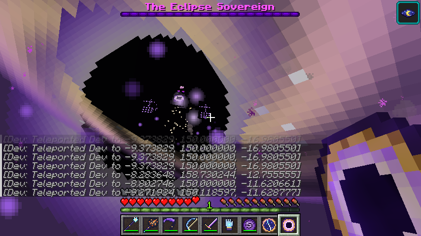

---

## Installation (CurseForge, about one minute)

| Requirement | Version |
|---|---|
| Minecraft Java Edition | **26.2** |
| Forge | **65.1.0** (Recommended) |
| Java | 25 (CurseForge installs this for you) |
| Other mods / libraries | **None.** Starforged is a single standalone jar. |

1. In the CurseForge app, go to **Minecraft → Create Custom Profile**, pick **26.2** and the **Forge 65.1.0** loader, then click **Create**.
2. On the profile, click **⋯ → Open Folder**, then open the **`mods`** folder (create it if it isn't there).
3. Copy **[`release/starforged-1.1.0.jar`](release/starforged-1.1.0.jar)** into that `mods` folder.
4. Click **Play**. You should see *Starforged* in the **Mods** list on the title screen.

*Without CurseForge:* run the official installer
`forge-26.2-65.1.0-installer.jar` from https://files.minecraftforge.net, pick **Install client**, put the jar into
`.minecraft/mods`, and launch the *forge* profile. For a **server**, put the same jar in the server's `mods` folder.
Players need the mod too.

---

## Showcase in 60 seconds (great for recording)

Create a **Creative** world with **cheats on**, then type:

| Command | What happens |
|---|---|
| `/starforged help` | Lists all showcase commands |
| `/starforged kit` | Gives every legendary weapon and gadget, plus Starforged armor (Eclipse Crown, Starmetal chest/legs, Comet Boots) |
| `/starforged starfall start 120` | Starts a **Starfall** now: title card, violet sky, shooting stars, meteors crashing around every player. Run `/time set midnight` first for the full effect |
| `/starforged meteor 5` | Calls 5 meteors down near you |
| `/starforged observatory` | Builds a full **Fallen Observatory** on the ground where you stand |
| `/starforged locate` | Finds the nearest naturally generated observatory |
| `/starforged boss` | Builds a Celestial Altar in front of you and plays the **full summoning cinematic** for the Eclipse Sovereign |
| `/starforged sunkit` | Gives every Sunforged weapon and gadget, a Solar Key, a Phoenix Egg, and Sunforged armor |
| `/starforged sunlands` | Sends you straight to the Sunlands |
| `/starforged suntemple` | Builds a full **Sun Temple** where you stand |
| `/starforged sunwarden` | Places a Sun Altar ahead of you and plays the **Sun Warden's rising cinematic** |

All items are also in the **Starforged** and **Sunforged** creative tabs.

**Filming tips**
- Switch to **Survival** (`/gamemode survival`) for the boss fight. Like vanilla bosses, the Sovereign doesn't attack creative players. `/effect give @s resistance 600 3` keeps you alive for B-roll.
- While you're in creative it just hovers and waits, so you can set up shots. It only leaves once no player has been within about 96 blocks for 60 seconds.
- Hold **F1** to hide the HUD. Camera shake can be turned off in `config/starforged-common.toml` (`screenShake = false`).
- For epic thumbnails: `/time set midnight`, then `/starforged starfall start 300`, then glide around in the Nebula Cloak.

---

## The journey (survival progression)

1. **The Starfall.** The first night of a new world always brings one; after that there's a 25% chance each night. Shooting stars streak across a violet sky and meteors scream down, blasting craters.
2. **Meteorites.** Craters hold *Meteorite Rock*, *Starmetal Ore* (needs an iron pickaxe) and *Astral Crystal Clusters*. Watch out for **Star Mite** swarms that pour out of fresh impacts and **Void Stalkers** that hunt in the dark. Sometimes a meteor is hollow and holds an **Astral Egg**.
3. **Starmetal.** Smelt *Raw Starmetal* into ingots for tools and armor that beat iron, plus the first star weapons: *Starcaller Staff*, *Meteor Hammer*, *Constellation Bow*.
4. **The Fallen Observatory.** Ruined astronomer towers generate in overworld plains, forests, taigas, savannas, deserts and badlands. Craft an **Astral Compass** to find one. Inside:
   - **Gravity Runes** launch you into the air and **Starfire Runes** erupt in flame. Sneak to tip-toe past them.
   - Some chests are **Mimics**.
   - **Astral Wraiths** haunt the library.
   - The **Vault Seal** dissolves only when you offer it *Stardust*.
   - Inside the vault, an **Astral Golem** statue is not a statue.
   - At the top: the telescope, the starglass dome and the **Celestial Altar**.
5. **The Last Seal.** The Golem drops a *Celestial Core*. Combine it with Void Essence and Astral Shards to craft the **Eclipse Sigil** (vaults sometimes hold one too). Use it on the Celestial Altar...
6. **The Eclipse Sovereign.** Defeat it to claim the *Eclipse Blade*, the *Crown of the Eclipse* and the *Sovereign's Heart*.

---

## Content

### Weapons and gadgets
| Item | Ability |
|---|---|
| **Starcaller Staff** | Right-click calls a meteor wherever you aim. Sneak + right-click rains a 7-meteor shower |
| **Meteor Hammer** | Right-click to leap skyward, then crash down in a fiery shockwave (right-click in mid-air dives early). Every hit launches enemies. Mines like a pickaxe |
| **Void Scythe** | Heals you on every hit. Right-click **Reap**: a 360° void sweep that drags enemies into the blade |
| **Constellation Bow** | Arrows become homing starbolts. A full draw fires three |
| **Eclipse Blade** *(boss drop)* | Right-click hurls a piercing crescent wave. Sneak + right-click casts **Total Eclipse**, a dome of darkness that slows, weakens and burns enemies |
| **Gravity Gauntlet** | Hold right-click to lift a creature with telekinesis. Release to hurl it |
| **Singularity Grenade** | Throw it to open a black hole that swallows mobs and items, then collapses |
| **Rift Pearl** | Reusable short-range teleport (36 blocks) |
| **Astral Compass** | Right-click to attune it to the nearest Fallen Observatory; the needle then points to it |

### Armor
| Armor | Ability |
|---|---|
| **Starmetal set** | Full set: Night Vision at night, half fall damage, and a **Starburst** that blasts attackers |
| **Comet Boots** | **Double jump** (press jump in mid-air) and no fall damage |
| **Nebula Cloak** | Elytra-style wings that need **no rockets**: a starwind pushes you along |
| **Crown of the Eclipse** *(boss drop)* | Permanent Night Vision, highlights every hostile mob nearby, resists void creatures |

### Creatures (all with custom models, animations and sounds)
| Creature | |
|---|---|
| **Star Mite** | Crystal-backed swarm bug. Hit one and the whole swarm turns on you |
| **Void Stalker** | Shadow that fades from sight, blinks behind you and blinds you. Starlight burns it |
| **Astral Wraith** | Ghost astronomer that floats and casts starbolts |
| **Mimic** | A chest with teeth. Chomps, hops after you, and drops great loot |
| **Astral Golem** | Vault guardian that sleeps as a statue. Ground-slam shockwaves and crystal volleys; has a boss bar |
| **Starling** *(pet)* | Hatch one from an Astral Egg. It follows you, gives Night Vision, and shoots starbolts at your enemies. Feed it Stardust |
| **Nebula Ray** *(mount)* | Giant sky manta that drifts through Starfall skies. Tame it with Stardust and fly it: look to steer, jump to climb |

### Boss: The Eclipse Sovereign (700 HP)
- **Entrance.** The altar fires a pillar of light, the sky goes dark ("THE STARS GO DARK"), lightning strikes, the starglass dome shatters, and the Sovereign descends to its own title card.
- **Attacks:**
  - *Starfall Barrage*: pulls meteors onto you.
  - *Eclipse Beam*: charges, then sweeps.
  - *Gauntlet Slam*: shockwaves.
  - *Singularity*: a black hole.
  - *Call of the Void*: summons Void Stalkers and Star Mites.
  - *Blink*: teleports to reposition.
  - *Supernova*: enraged only.
- **Phase 2.** At half health it raises four orbiting **Eclipse Crystals** and becomes immune. Shatter them (three hits each) to stun it, then it rises **ENRAGED**.
- **Rewards.** Eclipse Blade, Crown of the Eclipse, Sovereign's Heart, piles of starmetal, a chance at an Astral Egg, and the *Devourer No More* challenge advancement.

### Blocks
Meteorite Rock, Starmetal Ore, Astral Crystal Cluster, Block of Starmetal, Astral Bricks (plus cracked, chiseled,
stairs and slab), Starglass, Star Lantern (animated), Gravity Rune, Starfire Rune, Vault Seal, Celestial Altar.

### Also included
- Two advancement trees with 23 advancements.
- 83 custom sounds with subtitles.
- 8 custom particle types.
- Camera shake on big impacts.
- An eclipse sky tint.
- Custom death messages.
- Every block and item is craftable or obtainable in survival (use JEI or the recipe book to browse recipes).

---

## ☀ Sunforged: the second tier

### Getting there
1. Defeat the Eclipse Sovereign and take its **Sovereign's Heart**.
2. Craft a **Solar Key**: Sovereign's Heart in the middle, 4 Blocks of Starmetal on the sides, 4 Stardust in the corners.
3. Use the key on the ground in the Overworld. A **Solar Gateway** of liquid sunlight rises a few blocks ahead. Step in.
   A matching gateway is built on the other side, so you can always walk home the same way.

### The Sunlands
A dimension where it is always noon under a golden sky. Rain back home never reaches it.

| Biome | What you'll find |
|---|---|
| **Ember Plains** | Ashen soil, sunbloom flowers, Ember Hound packs |
| **Gilded Dunes** | Rolling golden sunsand, Magma Crawlers and the odd Ashen Knight |
| **Basalt Spires** | Towering basalt and drifting ash, patrolled by Ashen Knights |
| **Ember Caldera** | Lava lakes and magma, swarming with Magma Crawlers and Cinder Imps |

**Sunstone Ore** (diamond pickaxe) and **Ember Crystal Clusters** generate throughout. Solar Phoenixes glide over the plains and dunes.

### Sunsteel (stronger than netherite)
Smelt *Raw Sunsteel* into **Sunsteel Ingots**. Tools use a blaze rod handle.

| | Sunsteel | Netherite |
|---|---|---|
| Tool durability | 2600 | 2031 |
| Mining speed | 10.5 | 9 |
| Armor toughness | 3.5 | 3 |

Full Sunsteel set (**Sunborn**): immune to fire and lava, and anything that hits you bursts into flame.

### Weapons and gadgets
| Item | Ability |
|---|---|
| **Solar Lance** | Right-click: dash forward as a streak of sunfire, skewering everything in your path |
| **Phoenix Bow** | Needs no arrows. Fires homing phoenixes; a full draw looses three that hunt separate foes |
| **Helios Scepter** | Summons a miniature sun that orbits you for 20 seconds and lances enemies with sunbeams |
| **Cinder Chakram** | A ring of fire that leaps between up to four enemies, then flies back to your hand |
| **Sunburst Flask** | Throwable flash that burns, blinds and slows everything nearby |
| **Flare Greatsword** *(boss drop)* | Right-click hurls an exploding solar flare. Sneak + right-click: a ring of erupting sunfire |

### Armor
| Armor | Ability |
|---|---|
| **Phoenix Mantle** | Glide without rockets. Once every five minutes it **cheats death** in an explosion of fire |
| **Magma Treads** | Lava hardens under your feet so you can walk across it (sneak to sink). Fire immune |
| **Solar Crown** *(boss drop)* | Nearby enemies smoulder and burn. Fire immunity and Night Vision |

### Creatures
| Creature | |
|---|---|
| **Cinder Imp** | Winged fire-sprite that hovers out of reach and fires volleys of sparks |
| **Magma Crawler** | Lava beast that walks on lava and pounces, setting you alight |
| **Ember Hound** *(tameable)* | Hunts in packs. Tame one with **Solar Essence** and it fights for you; right-click with an empty hand to sit |
| **Ashen Knight** | Shield up: frontal hits are mostly blocked and arrows bounce off. Get behind it, and dodge its **Ember Cleave** |
| **Solar Phoenix** *(mount)* | Tame with Sunbloom or hatch a **Phoenix Egg**, then ride it: look to steer, jump to climb. Gives its rider fire resistance |

### The Sun Temple
A stepped ziggurat in the Ember Plains, Gilded Dunes and Basalt Spires. Inside:
- A gauntlet of **Sunfire Vents** that erupt in sequence, Cinder Imp spawners and Ashen Knight guards.
- A hidden vault under cracked tiles.
- Four unlit **Solar Braziers**. Light them all (flint and steel, a fire charge or an Ember Shard) and the **Sun Seal** burns away, opening the stair to the summit.
- On the summit: the **Sun Altar**.

### Boss: The Sun Warden (900 HP)
Craft a **Sunfire Sigil** (Sunsteel Block, Solar Essence and Ember Shards) and use it on the Sun Altar.
- **Entrance.** The temple shakes, a ring of fire erupts and the Warden rises out of the stone to its title card.
- **Attacks:** Sunfall meteors, a charged Solar Beam, rings of flame pillars, a ground slam with jumpable shockwaves, a sword sweep, a burning corona, and Cinder Imp reinforcements.
- **Supernova.** At half health it turns invulnerable and raises four **Solar Pylons** that heal it. You have 30 seconds:
  - shatter all four (4 hits each) and it kneels, **stunned and taking 50% more damage**, or
  - fail and the Supernova detonates across the summit.

  Either way it then fights **ENRAGED**.
- **Rewards.** Flare Greatsword, Solar Crown, Heart of the Sun, a chance at a Phoenix Egg, and the *Eclipse of the Sun* challenge advancement.

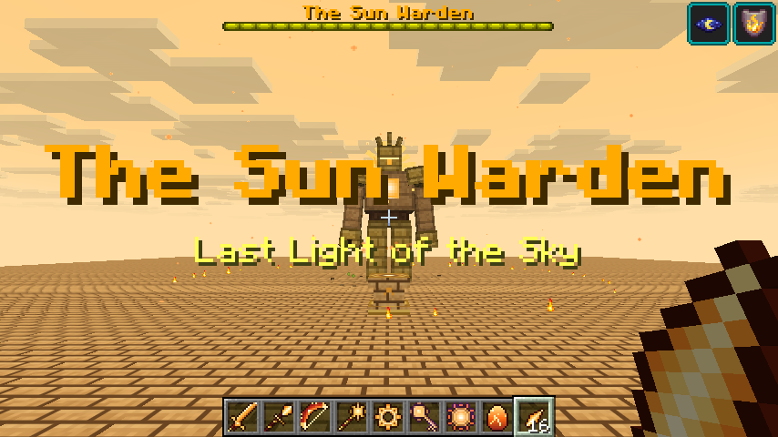

---

## Screenshots
| | |
|---|---|
| 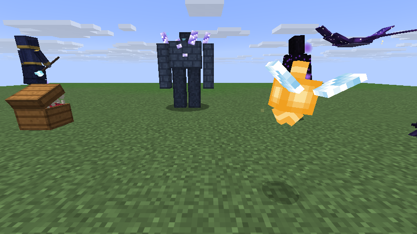 | 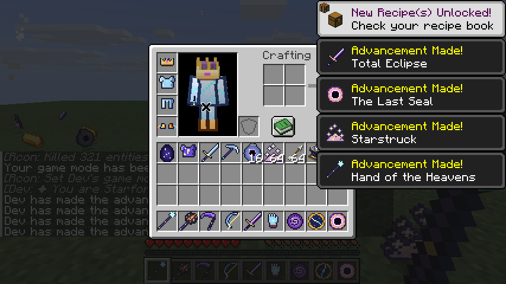 |
| 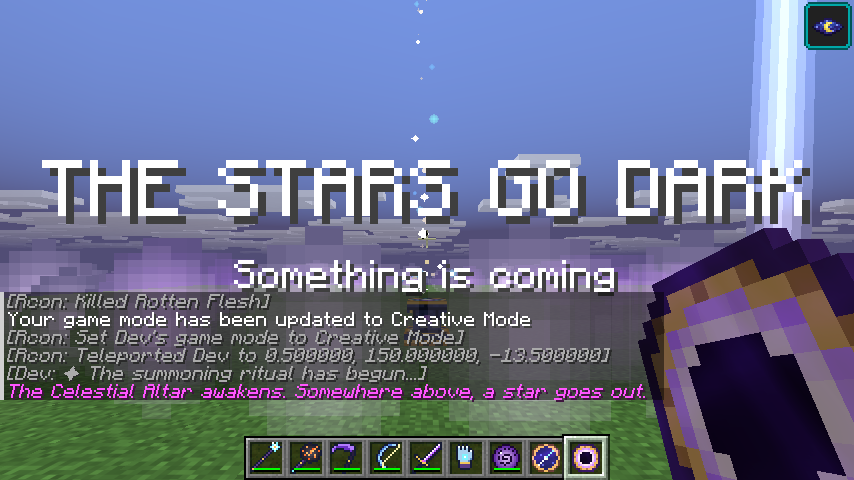 | 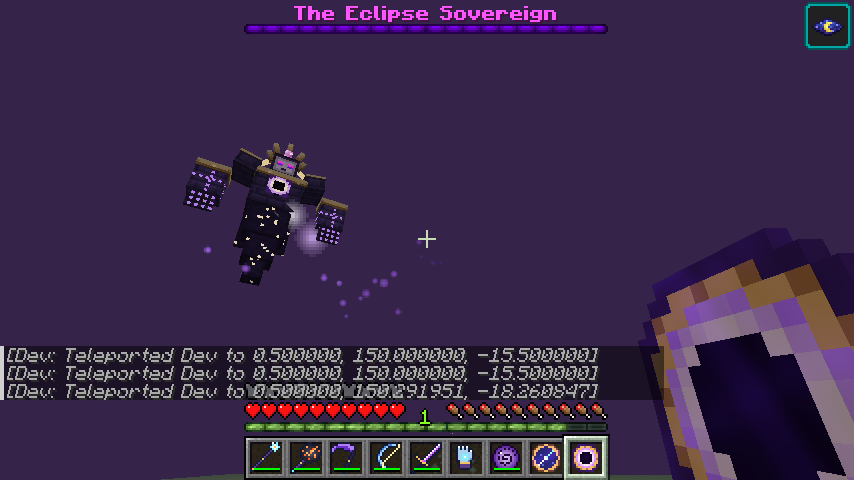 |
| 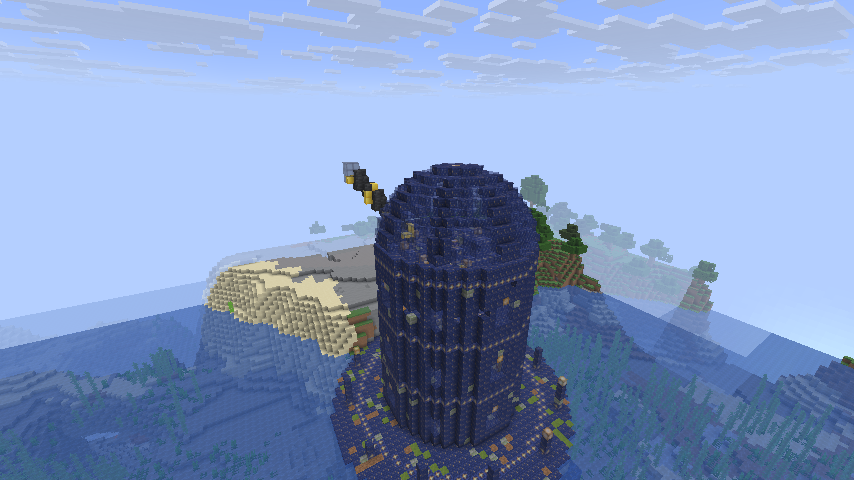 | 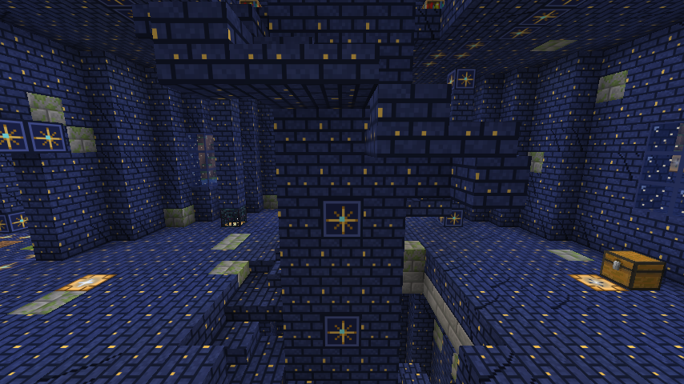 |
| 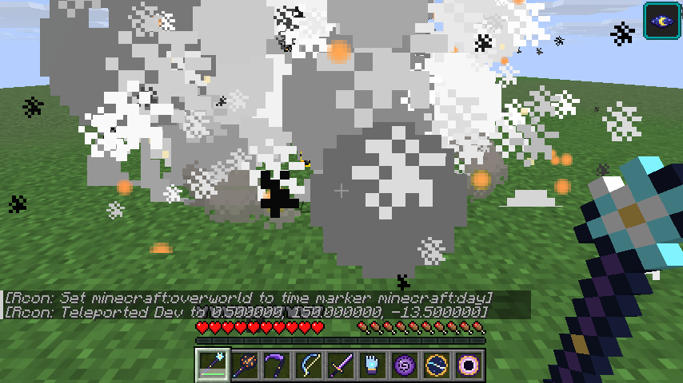 | 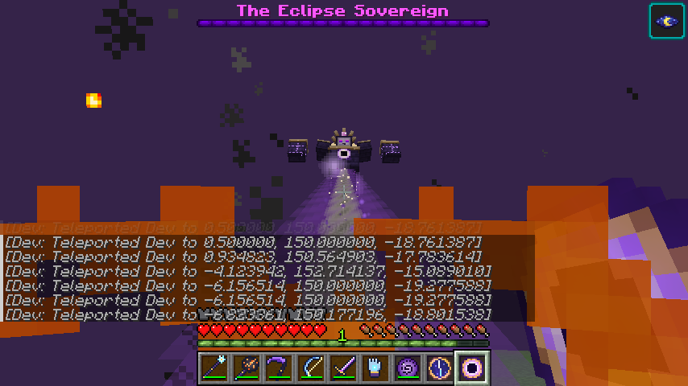 |

Full boss fight, frame by frame: [boss_fight_sequence.png](docs/screenshots/boss_fight_sequence.png) ·
Weapons: [weapons.png](docs/screenshots/weapons.png)

**Sunforged**
| | |
|---|---|
| 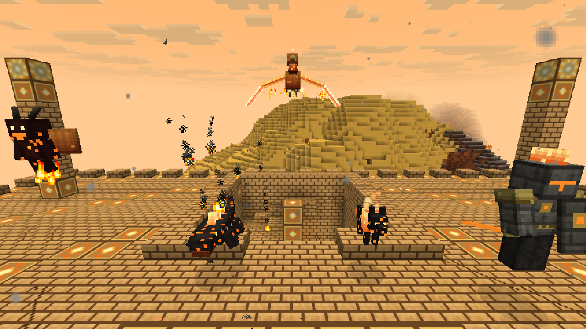 | 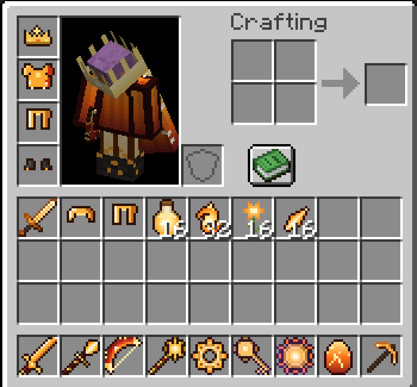 |
| 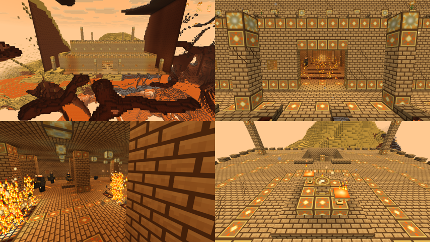 | 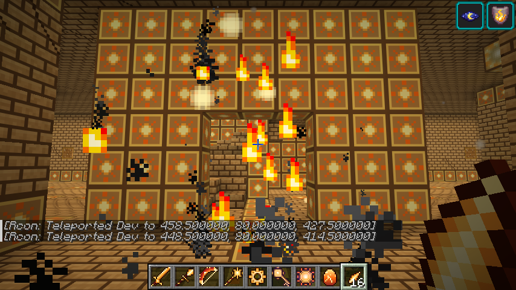 |
| 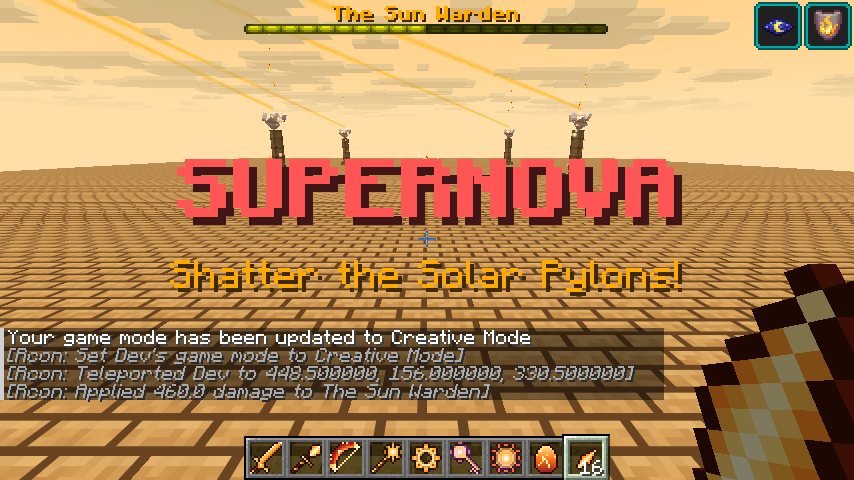 | 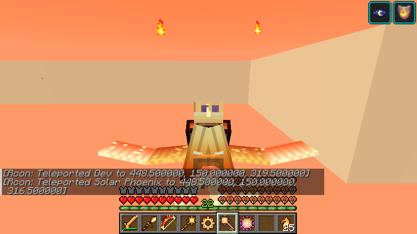 |
| 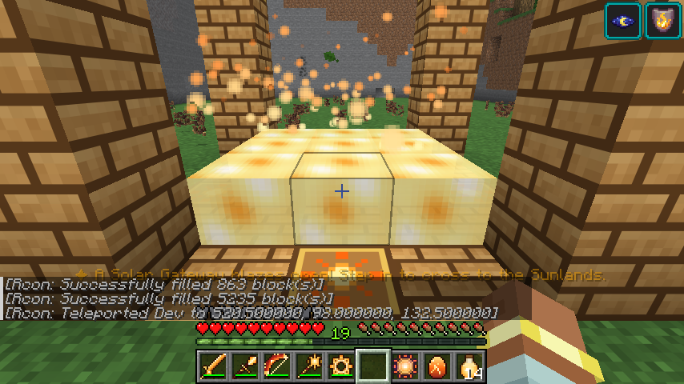 | 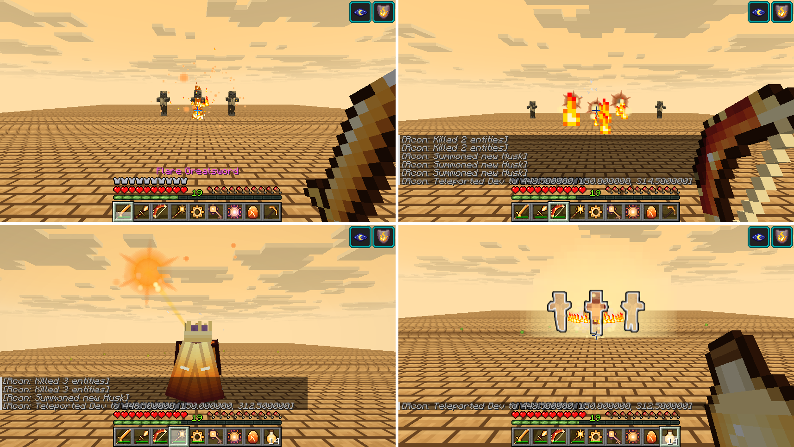 |

---

## Configuration
`config/starforged-common.toml`:

| Setting | Default | What it does |
|---|---|---|
| `starfallChance` | `0.25` | Chance of a Starfall each night |
| `firstNightStarfall` | `true` | Guarantees a Starfall on a world's first night |
| `meteorInterval` | `140` | Average ticks between meteors during a Starfall |
| `meteorCraters` | `true` | Whether natural meteors blast craters |
| `bossBreaksDome` | `true` | Whether the Sovereign's arrival shatters the observatory dome |
| `screenShake` | `true` | Camera shake on impacts |

---

## Building from source
Requires JDK 25.
```
cd starforged-mod
./gradlew build          # → build/libs/starforged-1.1.0.jar
./gradlew runClient      # dev client
./gradlew runServer      # dev server
```
Textures, models, sounds and data files are generated by the scripts in `tools/` (Python 3 with Pillow and NumPy;
`ffmpeg` with libvorbis is needed for the sounds):
`gen_textures.py`, `gen_models.py`, `gen_sounds.py` and `gen_data.py`, plus `gen_sun_textures.py`, `gen_sun_sounds.py`
and `gen_sun_data.py` for Sunforged (run each `_sun_` script after its base script). Run `gen_weapons.py --vanilla <vanilla item texture folder>` after
`gen_textures.py`: it redraws the weapon and tool sprites (the Starmetal tools reuse the vanilla diamond tool shapes).

## Tested
- Built against the official Forge 26.2-65.1.0 MDK with Java 25.
- Loaded from the `mods` folder of a server installed with the official **Forge 26.2-65.1.0 installer**, with no errors.
- Played on a dev client connected to a dev server. Checked:
  - every creature renders and animates
  - the kit, armor rendering and advancements
  - Starcaller Staff, Meteor Hammer, Eclipse Blade and Singularity Grenade abilities, and the Astral Compass search
  - the full summoning cinematic and boss fight, including the shield phase, death and loot
  - observatory generation (natural and by command)
  - Starfall and meteors
  - Sunforged: all four Sunlands biomes, gateway travel both ways, every Sunforged weapon and armor ability,
    taming the Ember Hound, hatching and riding the Solar Phoenix, the brazier puzzle, and the Sun Warden fight
    through both Supernova outcomes, death and loot

License: MIT.
